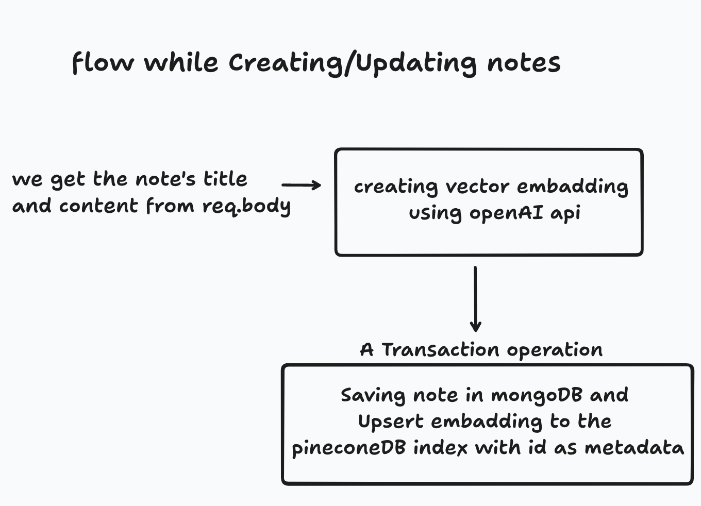

# AI Note Keeper

This is a note-taking app with an integrated **AI chatbot**. By using the **ChatGPT API**, **vector embeddings**, and **Pinecone**, the chatbot knows about all notes stored in your user account and can retrieve relevant information to answer your questions and summarize information.

**Response streaming** is implemented via the **Vercel AI SDK**.

The app is built with Next.js 14's app router, TailwindCSS, Shadcn UI, and TypeScript. It has a light/dark theme toggle and a fully mobile-responsive layout.

### Flow while creating/updating notes

### Flow while Asking AI Chatbot

